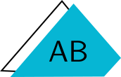

# @annebrown.ca/vue3-fleet-pub


## Description

Open-source, V3 Component Library

`NaviTree` is a standalone `Vue3` component, used to generate a customizable, hierarchical, interactive navigation tree, from a flat array of navi objects. `NaviTree` uses props for styling and initial expansion with depth control.

`SourceNaviTree` is a `Nuxt3` component, producing a navigation tree from a `@Nuxt/Content3` collection.  Collection contents require a `title` and `description` in markdown frontmatter.

`PagesNaviTree` sources `Nuxt3` components under `pages/` whose page meta must include `title` and `description`.

## Installation

```bash
pnpm add @annebrown.ca/vue3-fleet-pub
```

## Usage

`SourceNaviTree` and `PagesNaviTree` are `Nuxt3` components:

```vue
<template><div>
    <p><b>Collection Name: Docs</b></p><br/>
    <SourceNaviTree 
        sourcePrefix="/docs"
        :initialExpansionLevel="0" // Collapsed
    />

    <p><b>@/pages Navi Tree: All Pages</b></p><br/>
    <PagesNaviTree
        baseRoutePrefix="/"
        :initialExpansionLevel="1" // Expand top level
    />

    <p><b>@/pages/admin: Admin Section</b></p><br/>
    <PagesNaviTree
        baseRoutePrefix="/admin"
        :initialExpansionLevel="999" // Expand All
    />
</div></template>

<script setup lang="ts">
import { SourceNaviTree, PagesNaviTree } from '@annebrown.ca/vue3-fleet-pub'; 
    const pageTitle = 'Consuming Page Title'
    const pageDescription = 'Consuming Page Descr'
    definePageMeta({ 
        title: pageTitle, 
        description: pageDescription
    })
</script>
```

`NaviTree` `Nuxt3`:

```vue
<template><div>
    <NaviTree 
      :links="customLinks"
      ulClasses="list-none p-0 my-2"
      liClasses="text-gray-800 my-1"
      ulChildrenClasses="ml-4 list-none p-0"
      :initialExpansionLevel="1"
    />
</div></template>

<script setup lang="ts">
import { ref } from 'vue';
import { NaviTree } from '@annebrown.ca/vue3-fleet-pub'; 

interface NavigationLink {
  label: string;
  to?: string;
  children?: NavigationLink[];
  collapsible?: boolean;
}

// Navi Data object
const customLinks = ref<NavigationLink[]>([
  {
    label: 'Section One',
    to: '/section1',
    children: [
      { label: 'Item 1.1', to: '/section1/item1' },
      { label: 'Item 1.2', to: '/section1/item2', children: [
        { label: 'Sub-Item 1.2.1', to: '/section1/item2/sub1' }
      ]}
    ]
  },
  {
    label: 'Section Two (Leaf)',
    to: '/section2'
  },
  {
    label: 'Section Three',
    to: '/section3',
    children: [
      { label: 'Item 3.1', to: '/section3/item1' },
      { label: 'Item 3.2', to: '/section3/item2' }
    ]
  }
]);
</script>
```

## License

[MIT](./LICENSE)

